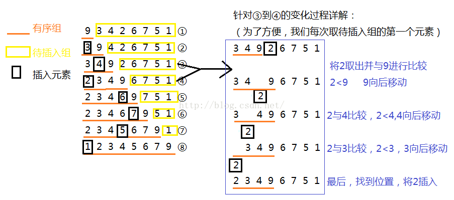

# 插入排序


 ,

```python
def insertionSort(alist):
    for key,item in enumerate(alist):
        #将列表里的元素先分为下标为0和后面的所有，将后面的所有元素依次和前一个相比，比完再和前面的前面相比，直到比到第一个，也就是key>=1的限制。
        while key>=1 and alist[key-1]>item:
            #如果前面的大于后面的，就必须换到后面，直到遇见不大于的，也不需要再和前面相比了，因为前面的之前就比过，已经分出大小了
            alist[key]=alist[key-1]
            key-=1
        #跳出循环，这个是alist[key-1]>item，要用到的，没有大于，就要把item值赋值到相应的位置上。
        alist[key]=item
    return alist
```

据书上的测试图来看，在数据量小于20的时候，插入排序具有最好的性能。当大于20时，快速排序具有最好的性能，归并(merge sort)和堆排序(heap sort)也望尘莫及，尽管复杂度都为nlog2(n)。 